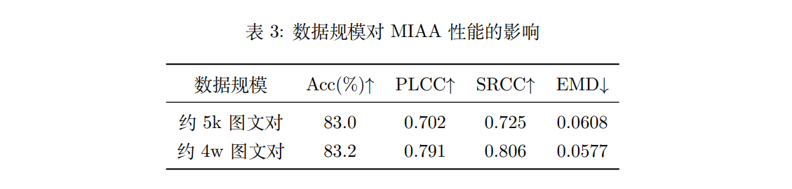
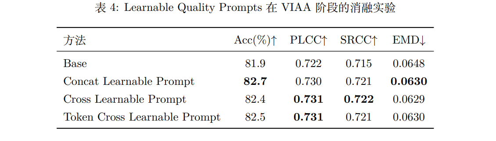
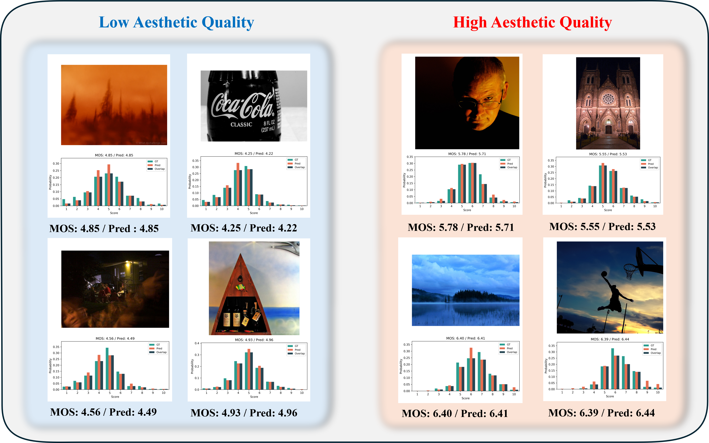
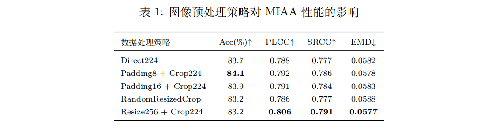
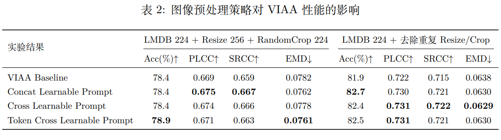

  

# AesFormer Reproduction and Learnable Quality Prompts

This repository contains a reproduction of AesFormer for image aesthetic assessment and additional experiments with Learnable Quality Prompts.

## Project Overview

This project focuses on multi-modal image aesthetic assessment (MIAA) and vision-only image aesthetic assessment (VIAA). The baseline model follows AesFormer, which uses Swin Transformer as the image encoder and BERT as the text encoder. Based on the VIAA stage, this project further introduces Learnable Quality Prompts to provide quality-level semantic guidance.

## Main Features

- Reproduction of AesFormer MIAA and VIAA stages
- LMDB-based dataset construction for DPC-Captions / AVA-Captions
- Data preprocessing ablation experiments
- Learnable Quality Prompts for VIAA
- Concat, Global Cross-Attention, and Token-Level Cross-Attention prompt fusion
- EMD distribution visualization with GT, Pred, and Overlap


## Exeperiment results






## Results Of Different Data Preprocessing Methods



## Environment

```bash
conda create -n aesformer python=3.9
conda activate aesformer
pip install -r requirements.txt

## Dataset Preparation

python convert_to_lmdb.py

## MIAA Training

python train_multimodal.py

## VIAA Training

python train_img.py

## Visualization

python visualize_emd_predictions.py \
    --csv_path ./data/test.csv \
    --checkpoint ./results/best_mean_srcc.pth \
    --output_dir ./vis_results \
    --max_samples 100 \
    --branch mean

## Notes

Large files such as datasets, LMDB files, pretrained weights, and checkpoints are not included in this repository.

